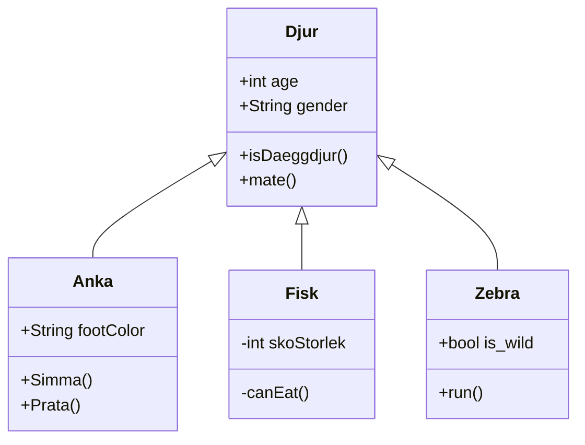

# Userstory-013

```
mermaid
classDiagram
      Djur <|-- Anka
      Djur <|-- Fisk
      Djur <|-- Zebra
      Djur : +int age
      Djur : +String gender
      Djur: +isDaeggdjur()
      Djur: +mate()
      class Anka{
          +String footColor
          +Simma()
          +Prata()
      }
      class Fisk{
          -int skoStorlek
          -canEat()
      }
      class Zebra{
          +bool is_wild
          +run()
      }
```




