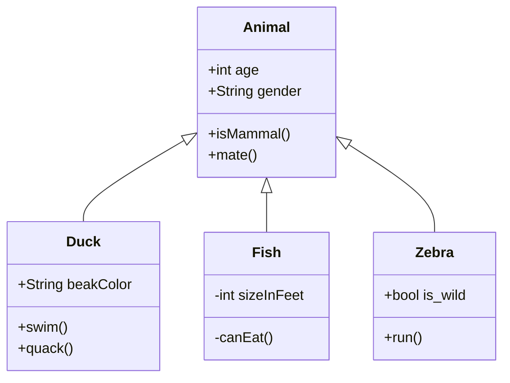

# Userstory-013

```
classDiagram
class BankAccount
BankAccount : +String owner
BankAccount : +BigDecimal balance
BankAccount : +deposit(amount)
BankAccount : +withdrawal(amount)
```


```mermaid
classDiagram
      Animal <|-- Duck
      Animal <|-- Fish
      Animal <|-- Zebra
      Animal : +int age
      Animal : +String gender
      Animal: +isMammal()
      Animal: +mate()
      class Duck{
          +String beakColor
          +swim()
          +quack()
      }
      class Fish{
          -int sizeInFeet
          -canEat()
      }
      class Zebra{
          +bool is_wild
          +run()
      }
```


